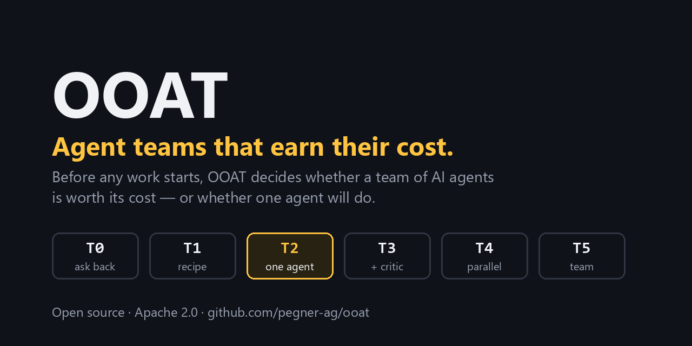

# OOAT — Object-Oriented Agent Team

[](https://github.com/pegner-ag/ooat/actions/workflows/tests.yml)
[](LICENSE)



Agent teams that earn their cost. OOAT asks, before any work starts, whether a team of AI agents is worth
its cost or whether one agent will do — and when a team is justified, builds it from specialists defined by
contracts, prices and tested success rates, with every step recorded in a ledger and every irreversible
action waiting for a named human.

- Why: [`spec/manifesto.md`](spec/manifesto.md)
- How: [`spec/ooat-specification.md`](spec/ooat-specification.md) (draft v0.1)
- Decisions: [`docs/adr/`](docs/adr/)

## Status

Early F1 (spec draft v0.1): JSON Schemas, the starter catalog taxonomy, the ledger, the provider gateway with
three model connectors and one decision connector (Jev), the `ooat connectors` command, the Topology Gate
for T0–T2, the task runtime (`ooat task`, `ooat hil`) and `ooat serve` (REST API, sessions, operator tokens) exist; the web screens and teams (T3+) do not yet.
Decision records are in `docs/adr/`.

## First steps

Create `ooat.toml` in your working folder (a relative ledger path resolves next to this file):

```toml
[ledger]
url = "sqlite:///ooat-ledger.sqlite"

[policy]                          # optional limits, enforced by the gateway
blocked_countries = ["CN"]        # no connector whose vendor or model comes from these countries
personal_data_regions = ["eu"]    # personal data only to connectors processing in these regions
```

```sh
python -m pip install -e core -e adapters/claude-code -e adapters/codex -e adapters/anthropic-api \
    -e adapters/typesafe-jev -e adapters/antigravity-cli
ooat connectors list                      # installed connectors and their state
ooat connectors show prv.anthropic.api    # connection consequences card
ooat connectors enable prv.anthropic.api --operator "Your Name"
ooat connectors approve-hooks prv.google.subscription_cli --operator "Your Name"   # if agy has hooks
```

Choosing `client_confidential` or `personal` when enabling a connector asks you to take responsibility for that
data (legal basis, processing agreement, where it is processed). OOAT records it with your name and date and asks
again after 12 months. Text with an e-mail address, phone number or similar is treated as personal data, so allow
`personal` on at least one connector if your tasks contain such details.

Then submit a task; it runs in the foreground and asks you when the Gate needs an answer:

```sh
ooat task submit --operator "Your Name" --project my-site --goal "Summarise the attached contract" \
    --acceptance "At most 300 words" --file contract.txt
ooat hil list                                  # questions waiting for you
ooat hil answer <evt_id> --operator "Your Name" --text "..."
ooat task show <tsk_id>                        # timeline, costs, the document
ooat task run --all                            # resume tasks paused by a provider outage or quota
ooat task rate <tsk_id> --operator "Your Name" --accepted yes --value B
```

`ooat serve` runs the REST API and the task runner on `127.0.0.1:8765` and prints a one-time sign-in link for
`[serve] operator` (`ooat login --operator <name>` prints another). A bot gets its own token, shown once:

```sh
ooat serve
ooat tokens create --operator "Your Name" --name telegram --scopes submit,read,answer,rate
```

`enable` and `disable` need an `ooat.toml`, so state always lands in the same ledger. Settings live in
`ooat.toml` (ledger URL, per-tier pins, connector settings; secrets only as environment
variable names); prices and the data-class policy in `catalog/routing.json`.

## Repository layout

| Folder | Content |
|---|---|
| `spec/` | Specification, manifesto; JSON Schemas of the OOA Spec |
| `catalog/` | Capability, role, family, routing and provider cards (JSON) |
| `core/` | `ooat-core` reference runtime (Python) |
| `sdk/` | Python and TypeScript SDKs |
| `adapters/` | Provider, store and notifier adapters |
| `dashboard/` | Web dashboard (TypeScript) |
| `evals/` | Capability eval sets and calibration tasks |
| `docs/` | Current-state documentation and decision records |

## Contributing

See [CONTRIBUTING.md](CONTRIBUTING.md), the [Code of Conduct](CODE_OF_CONDUCT.md) and the [security policy](SECURITY.md).

## Licence

Apache License 2.0 — see [`LICENSE`](LICENSE).
